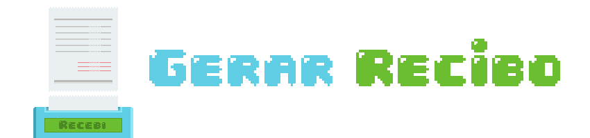

  

> Plataforma gratuita para criação de recibos profissionais para estéticas automotivas e lava-jatos — personalize, gere e compartilhe em segundos.

  
  

## 📖 Sobre o Projeto

O **Recebi** é uma ferramenta simples e direta para quem trabalha com estética automotiva ou lava-jato e precisa emitir recibos com aparência profissional, sem complicação. Com uma interface intuitiva, você pode:

- 🧾 Criar recibos personalizados em poucos cliques;
- 🚗 Registrar os serviços prestados com descrição e valores;
- 🏢 Cadastrar os dados do seu negócio e do cliente;
- 🖼️ Inserir sua logo para dar identidade visual ao documento;
- 📄 Nomear o documento como quiser: recibo, orçamento, ordem de serviço, comprovante de pagamento e muito mais.

Acesse: https://recebi-ten.vercel.app

## 🎯 Características

- **Totalmente Personalizável**: Defina o nome do documento, dados do beneficiário, cliente, serviços e valores;
- **Sua Marca no Recibo**: Adicione a logo do seu negócio para um resultado mais profissional;
- **Múltiplos Tipos de Documento**: Gere recibos, orçamentos, comprovantes de pagamento ou ordens de serviço;
- **Geração Instantânea**: O recibo é gerado na hora, pronto para imprimir ou compartilhar;
- **Sem Cadastro**: Nenhuma conta necessária. Abriu, preencheu, gerou;
- **Responsivo**: Funciona em celular, tablet e computador.

## 💡 Por que o Recebi existe?

Grande parte dos lava-jatos e estéticas automotivas são negócios pequenos, muitas vezes sem CNPJ, sem sistema de gestão e sem uma forma simples de registrar os atendimentos. No fim do mês, na hora de organizar as entradas ou declarar os rendimentos, a dificuldade aparece: onde estão os comprovantes? Quanto foi cobrado em cada serviço?

O **Recebi** existe para esse público. Uma ferramenta gratuita, sem burocracia e sem necessidade de cadastro, que permite gerar um recibo profissional em segundos — seja para entregar ao cliente, guardar para o próprio controle ou usar na hora de declarar os rendimentos.

Simples assim. Sem sistema, sem mensalidade, sem complicação.

## 🛠️ Tecnologias Utilizadas

- HTML5
- CSS3
- JavaScript Vanilla

## 🤝 Como Contribuir

- ⭐ **Dê uma estrela no repositório** — isso ajuda o projeto a crescer!
- 🐛 **Encontrou um bug?** Abra uma issue descrevendo o problema;
- 💡 **Tem uma sugestão?** Todo feedback é bem-vindo;
- 📧 **Entre em contato:** nilton.f.o.junior@gmail.com

## 📝 Licença

Este projeto está sob a licença MIT. Você pode usar, modificar e distribuir livremente.

---

  "A beleza que vive no ato de compartilhar algo com o outro."

